# Gaffer Examples.   

    Last Updated: 30/04/2020

***Note: UVs/Surfacing/Lighting is in WIP***


[Setup](#Setup)  
[Templates](#Templates)  
[&nbsp;&nbsp;&nbsp;&nbsp;Assets Template](#Assets-Template)  
[&nbsp;&nbsp;&nbsp;&nbsp;Shots Template](#Shots-Template)  
[&nbsp;&nbsp;&nbsp;&nbsp;&nbsp;&nbsp;&nbsp;&nbsp;Barbershop](#Barbershop)  
[&nbsp;&nbsp;&nbsp;&nbsp;&nbsp;&nbsp;&nbsp;&nbsp;Clasroom](#Clasroom)  
[Contribute! Help wanted](#Contribute)  
[licences](#licences)  

## Setup 
#### Before you start
Unzip the barbershop alembic file `/barbershop/abc/babershop_interior.abc.tar.7z`.   
Alternatively you can run `expand-assets.sh` to unzip it using `file-roller`.

#### Enviroment Variables
`source gaffer-examples.sh` before runing gaffer.  
Alternatively set those environments in your system.

#### Gaffer Version
Requires 0.57.1.0 or above.

## Templates
    Note on GPU render: Ai User Data String and Trace Sets are not supported
    in GPU render.
    Shots Template: Turn the barbershop Reference Node gpu_uncompat_nodes Off.
    Asset Template: Prune the Shader balls reference.

### Assets Template
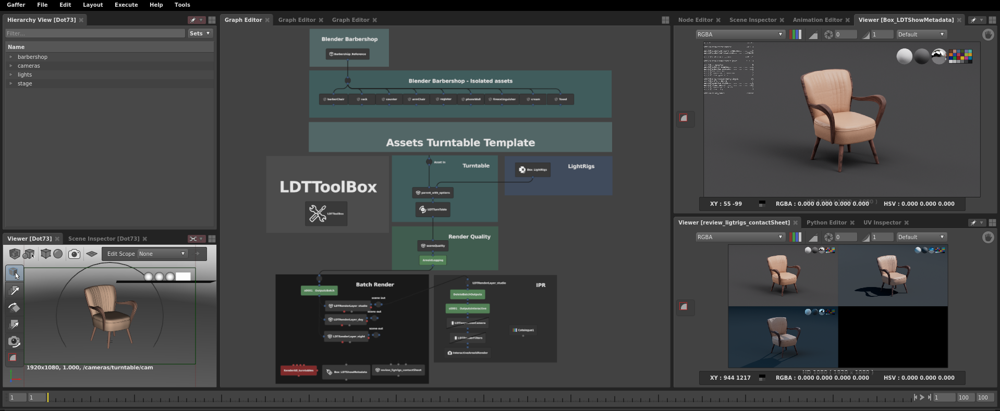

    Asset Template, with lightrigs wedge Render, metadata overlay and ContactSheet.

### Shots Template

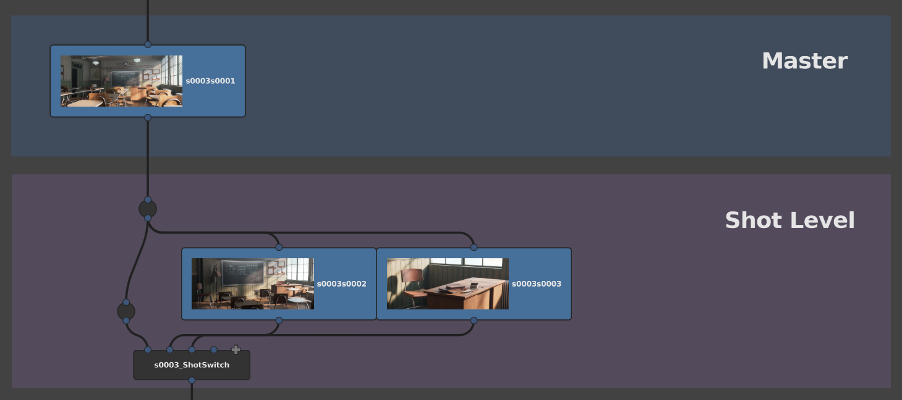

    Shot level Box nodes containing overrides, with rendered icons

### Template Outputs

    Note: UVs/Surfacing/Lighting is in WIP. No compositing, beauty pass only.

#### Barbershop
##### Sequence 1 & 2
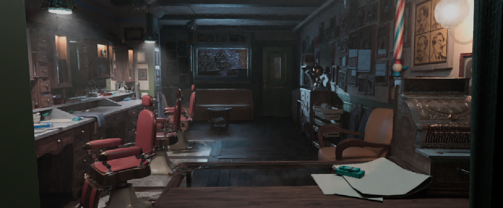 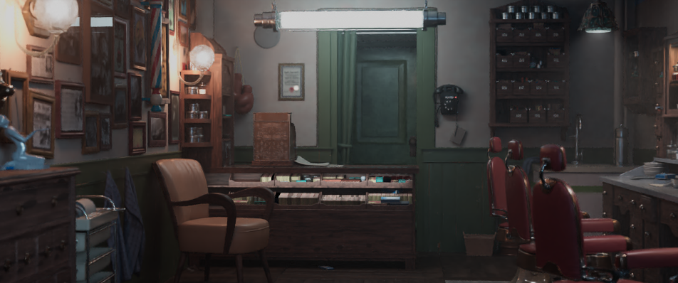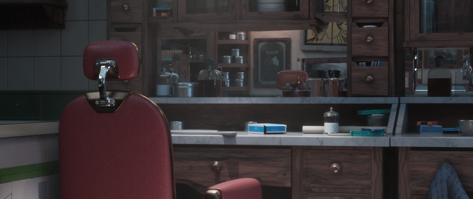 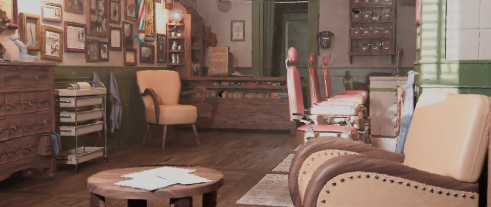 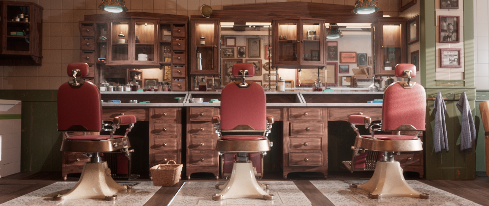 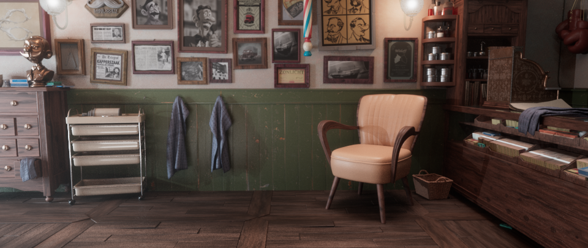  

#### Clasroom 
##### Sequence 3 & 4
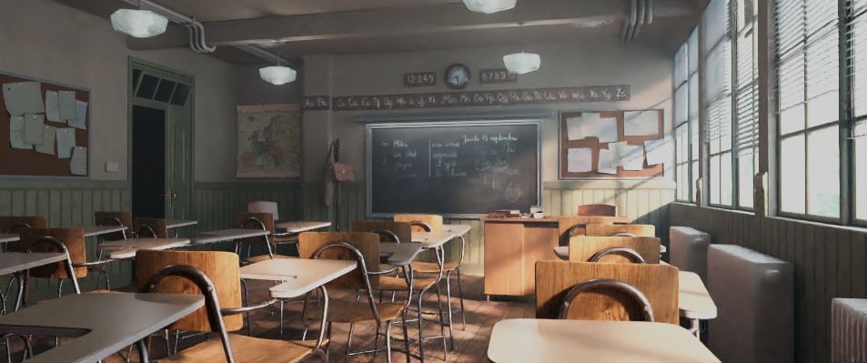 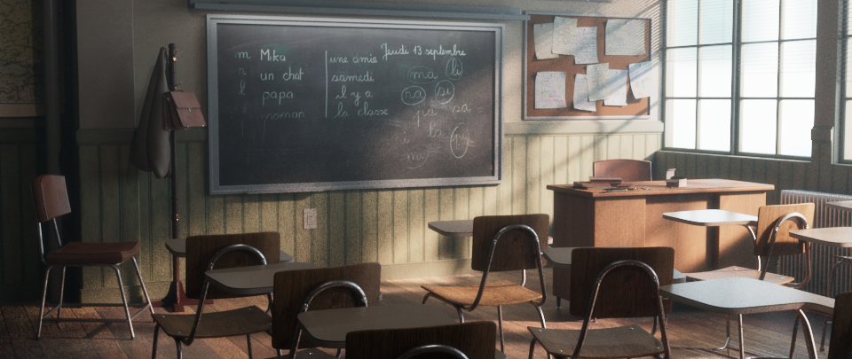 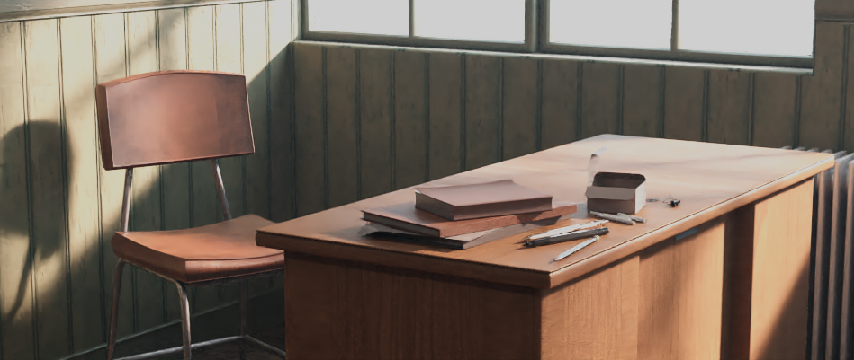 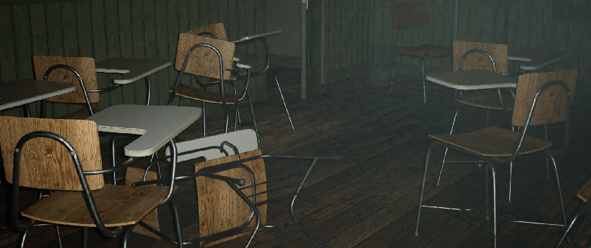 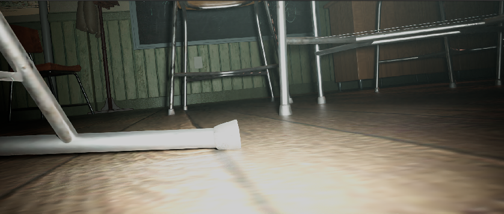


## Licences
Different parts of this repository, are given with different licences.   
You can find the plaintext legalcode licence files under each folder where applicable.  

##### Clasroom 
Blender Classroom By Christophe Seux.  
Terms of Use: This work is licenced under [CC0](https://www.blender.org/download/demo-files/)

##### Barbershop
Blender Barbershop from "Agent 327" by Blender Institute   
Terms of Use: This work is licenced under [CC-BY-ND](https://cloud.blender.org/p/agent-327/about).   

Change list:
- Gaffer Scene converted from Original Blender file.   
- Export/Conversion was not possible at a 100% match.   
Certain elements -such as:objects/uvs/textures- did not translate properly   
Conversion is still pretty much in WIP and will continue to improve,  
following the original work.


##### PBR Textures
###### cc0textures
PBR textures by [www.cc0textures.com](https://www.cc0textures.com)   
Terms of Use: This work is licenced under [CC0](https://help.cc0textures.com/doku.php?id=website:licence)

###### 3dtextures me
PBR textures by [https://3dtextures.me/](https://3dtextures.me/)   
Terms of Use: This work is licenced under [CC0](https://3dtextures.me/about/)

##### HDRIs
###### Pixar Renderman Stinson Beach
Stinson Beach HDRI files by Loren Carpenter from [piper-look-dev](https://renderman.pixar.com/piper-look-dev)   
Terms of Use: This work is licenced under [CC BY-NC-SA](https://creativecommons.org/licenses/by-nc-sa/4.0/)


###### hdrihaven
HDR under /resources/hdri/hdrihaven by [www.hdrihaven.com](https://hdrihaven.com/)   
Terms of Use: This work is licenced under [CC0](https://hdrihaven.com/p/licence.php)

###### zbyg
HDR under /resources/hdri/zbyg by [zbyg](https://www.deviantart.com/zbyg/art/HDRi-Pack-2-103458406)   
Terms of Use: This work is licenced under [CC BY](https://creativecommons.org/licences/by/3.0/)

###### Icons
String lights icon by supalerk laipawat from the Noun Project   
Set Lights by Lluisa Iborra from the Noun Project  
Camera aperture tool by Vectors Point from the Noun Project  
Videocamera by Vichanon Chaimsuk from the Noun Project  
Rotation by Andrejs Kirma from the Noun Project  
Setting by ghufronagustian from the Noun Project  
Gear by Gan Khoon Lay from the Noun Project  
Fork by useiconic dot com from the Noun Project  
Layers by Creative Stall from the Noun Project  
Layers by Bernar  Novalyi from the Noun Project  
Tag by Marta Ambrosetti from the Noun Project  
Settings by Fahmi Ramdani from the Noun Project  
Tools by Vectors Point from the Noun Project  
Start by Larea from the Noun Project  
Restore by Phoenix group from the Noun Project


##### About CC0, CC-BY, CC-BY-ND and CC BY-NC-SA
[CC0 Universal Public Domain Dedication](https://creativecommons.org/publicdomain/zero/1.0/)   
[CC BY](https://creativecommons.org/licences/by/3.0/)  
[CC BY-ND](https://creativecommons.org/licences/by-nd/2.0/)  
[CC BY-NC-SA](https://creativecommons.org/licenses/by-nc-sa/4.0/)

## Contribute
### Help needed!
Do you feel like:
* helping with assets surfacing or lighting Setups?
* sharing cool tricks, examples, templates, or workflows?
* improve the templates?
* helping translating the Assets and lighting to [Gaffer Cycles](https://github.com/boberfly/GafferCycles)?

#### How to Contribute
Before you start, contact us and let us know what you want to work on.  
Certain things -such as asset surfacing, and lighting updates- will need to be handled case by case, to ensure a smooth conflict-free update in the main files.  

[Fork, clone, branch, work, push, pull request as usual.](https://help.github.com/en/enterprise/2.16/user/github/collaborating-with-issues-and-pull-requests/creating-a-pull-request-from-a-fork)  

#### Style guide
[Examples style guide](https://github.com/GafferHQ/gaffer/wiki/Examples-Style-Guide)

##### Extra styling
###### Styling Exceptions
Where nodes are Shots or Sequence based, for better readability  we prefix these nodes with `SEQ0001`  for exampe `SEQ0001_RenderQuality` or `SEQ0001_SHO0002`
###### Icons
Icons are placed in /resources/icons.
To set a Node's icon, open the Node's EditUI window and set the Node icon as `/assets/resources/icons/iconName.png`
###### IconScale
You can set the Node's iconScale using the code snippet below.   
The values used in the templates are `3.0`, `5.0` or `7.0`, depending on the node importance.
Only Box Nodes are scaled.
```
import Gaffer
node = root['LDTTurnTable']
Gaffer.Metadata.registerValue (node, 'iconScale', 7.0)
```

#### Licences:
* When contributing you are agreeing to submit your work under a CC0 licence.  
Attributions -although not required by this licence- will be given in this repository.
* Files from external other sources need to be compatible with CC0 licence or its derivates. See the [licences](#licences) section.  
This includes -but is not limited to- textures, `.hdr` files, `.grf` files, python scripts, Gaffer Nodes, etc.
* Licences should be listed and specified for all external sources following their specific requirements.
* Attributions should be given, even in the case of CC0 licenced material that do not required them.  

        Not everybody is familiar with licences, in this case specially cc0 and its derivates.
        If you have concerns or questions about this subject, contact us.